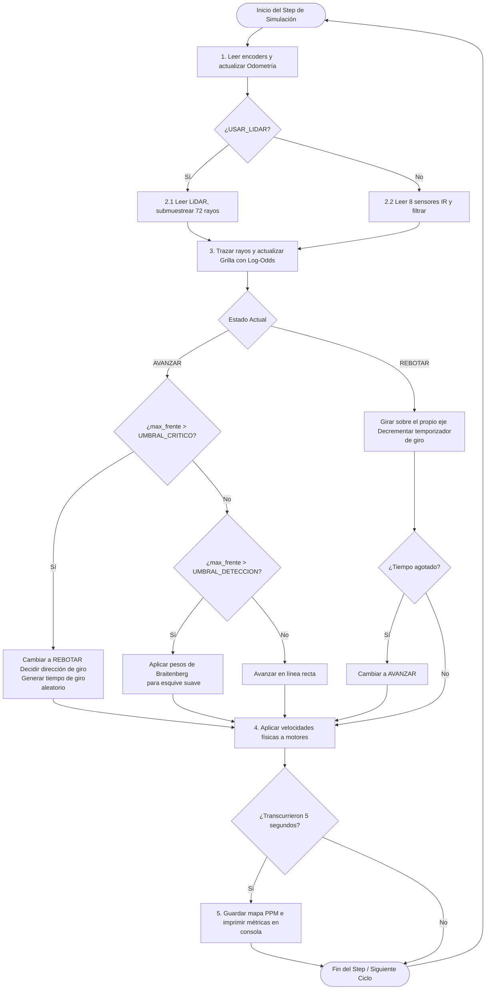

# Proyecto Final de Robótica: Navegación Autónoma con SLAM

**Integrantes:** Ignacio Javier Carrillo Ramírez

**Curso:** ICI4150-1 Robótica y Sistemas Autónomos

**Línea de desarrollo:** Línea B - SLAM o mapeo autónomo simplificado

---

## Índice de contenidos

1. [Objetivo del proyecto](#objetivo-del-proyecto)
2. [Descripción del robot, sensores y actuadores utilizados](#descripción-del-robot-sensores-y-actuadores-utilizados)
3. [Descripción de los escenarios de prueba](#descripción-de-los-escenarios-de-prueba)
4. [Explicación del algoritmo implementado](#explicación-del-algoritmo-implementado)
5. [Diagrama de flujo y pseudocódigo de la solución](#diagrama-de-flujo-y-pseudocódigo-de-la-solución)
6. [Relación explícita con los Laboratorios 1 y 2](#relación-explícita-con-los-laboratorios-1-y-2)
7. [Resultados obtenidos y métricas de desempeño](#resultados-obtenidos-y-métricas-de-desempeño)
8. [Conclusión, limitaciones y posibles mejoras](#conclusión-limitaciones-y-posibles-mejoras)
9. [Instrucciones de ejecución](#instrucciones-de-ejecución)

---

## Objetivo del proyecto

En este proyecto se diseña, implementa y evalúa un sistema de navegación autónoma para un robot móvil diferencial en el simulador Webots. El e-puck desarrollado es capaz de **explorar y contruir una representación del entorno** desconocido, actualizando el mapa según sus sensores.

El sistema integra **el control cinemático de movimiento**, **la percepción sensorial** a través de sensores infrarrojos de distancia y **la estimación de movimiento** mediante odometría de encoders. Con esto, se busca explorar y construir una grilla de ocupación 2D, aplicando conceptos de **SLAM** de forma simplificada y autónoma.

---

## Descripción del robot, sensores y actuadores utilizados

Para este proyecto utilizaremos un robot móvil diferencial **e-puck** en el entorno de simulación Webots. Los actuadores, sensores y sus respectivas extensiones se detallan a continuación:

### 1. Actuadores y Parámetros de Cinemática

El e-puck es un robot móvil de tracción diferencial con dos ruedas motrices controladas por motores paso a paso que actúan de forma continua por velocidad angular. Algunos parámetros básicos que caracterizan a este robot son:

* **Radio de las ruedas ($r$):** $0.0205\text{ m}$ ($2.05\text{ cm}$)
* **Distancia entre ruedas / Eje ($L$):** $0.052\text{ m}$ ($5.2\text{ cm}$)
* **Velocidad máxima de motores ($\omega_{max}$):** $6.28\text{ rad/s}$

### 2. Sensores de Odometría (Encoders de rueda)

El e-puck posee sensores de posición rotacionales integrados en cada rueda (`left wheel sensor` y `right wheel sensor`). Estos sensores se utilizan para medir la rotación acumulada en radianes. Las lecturas diferenciales de estos encoders se utilizan en el controlador del robot para calcular **el desplazamiento lineal incremental** ($\Delta s$) y actualizar su psotura global estimada $(x, y, \theta)$ mediante navegación estimada.

### 3. Sensores Infrarrojos de Distancia (IR)

El e-puck cuenta con 8 sensores de proximidad infrarrojos analógicos (`ps0` a `ps7`) distribuidos alrededor del anillo exterior de su cuerpo:

* **Ángulos:** Los sensores están orientados en ángulos específicos respecto al frente de la siguiente forma: `ps0` y `ps7` apuntan hacia adelante ($\approx 10^\circ$), `ps1` y `ps6` son diagonales frontales ($\approx 45^\circ$), `ps2` y `ps5` son laterales ($\approx 90^\circ$), y `ps3` y `ps4` apuntan hacia atrás.
* **Rango de efectividad:** El rango es muy corto, aproximadamente unos $0.04\text{ m}$ ($4\text{ cm}$).
* **Señal de salida:** Entrega valores analógicos en el rango $[0, 4095]$, donde mayor valor implica mayor proximidad física.
* **Procesamiento de datos:**
    * **Filtro de Media Móvil:** Se implementa una ventana de filtrado de $5$ muestras por sensor para estabilizar las lecturas, optimizar el rendimiento y suprimir el ruido analógico del simulador.
    * **Conversión a metros:** Las lecturas filtradas que superan un umbral mínimo de $80$ se mapean linealmente a distancia física real (metros) mediante la ecuación:
        $$d = d_{max} \cdot \left(1.0 - \frac{\text{valor\_filtrado}}{\text{valor\_maximo}}\right)$$

### 4. Sensor LiDAR (Light Detection and Ranging)

Para mejorar el alcance y la resolución del mapeo, se ha añadido una extensión del hardware en la ranura superior de expansión del e-puck (se puede ver en la simulación en la variable `turretSlot`):

* **Configuración del sensor:** LiDAR planar de 1 capa ($2\text{D}$ horizontal).
* **Barrido angular:** El sensor tiene una cobertura de $360^\circ$ ($2\pi\text{ rad}$) con una resolución horizontal de 360 muestras ($1$ lectura por grado).
* **Rango de efectividad:** Posee un rango mínimo de $0.02\text{ m}$ y rango máximo de $1.2\text{ m}$ (suficiente para cubrir el arena de $1\times1\text{ m}$ desde el centro).
* **Optimización por Software:** Con tal de evitar la ralentización de la CPU al trazar 360 rayos de Bresenham en cada paso del controlador, se realiza un submuestreo tomando 1 de cada 5 lecturas de barrido, lo que resulta en $72$ rayos de mapeo con resolución espacial óptima.

---

## Descripción de los escenarios de prueba

Los escenarios de prueba de este proyecto han sido diseñados en Webots dentro de una arena cuadrada cerrada de $1.0 \times 1.0\text{ m}$ delimitada por cuatro paredes. El punto de origen global de coordenadas $(0.0, 0.0)$ se encuentra exactamente en el centro de la arena. El robot e-puck inicia todas las ejecuciones en la coordenada $(0.0, 0.0, 0.0)$ (centro global) orientado hacia el frente.

Se diseñaron dos entornos diferentes con niveles crecientes de dificultad para evaluar la robustez de los algoritmos de navegación autónoma y la precisión del mapeo SLAM. Los escenarios son:

### 1. Escenario Simple (`escenario_simple.wbt`)

En este entorno se realizaron las pruebas para las fases de desarrollo iniciales, con tal de calibrar la odometría, comprobar las transformaciones de coordenadas y afinar la percepción de los infrarrojos del robot móvil.

* **Obstáculos:** El escenario contiene **3 cajas de cartón** cúbicas de tamaño $10 \times 10 \times 10\text{ cm}$.
* **Características del entorno:** Amplias zonas abiertas para tránsito libre, los obstáculos están alejados de las paredes exteriores, permitiendo realizar giros y maniobras de esquive sencillas sin peligro de bloquearse.

### 2. Escenario Complejo (`escenario_complejo.wbt`)

Este entorno fue diseñado para poner bajo estrés a la máquina de estados de rebote reactivo del e-puck, evaluando la resolución espacial del mapeo de LiDAR y observando los fenómenos de sombras del mapa.

* **Obstáculos:** El escenario contiene **4 cajas de cartón** cúbicas de tamaño $10 \times 10 \times 10\text{ cm}$ y **2 paredes interiores** delgadas (una vertical y otra horizontal, ambas de $20\text{ cm}$ de longitud).
* **Características del entorno:** La densidad de los obstáculos y la adición de paredes simula un laberinto mixto. Esto genera pasillos estrechos de ancho variable por el mapa, forzando al e-puck a transitar por áreas estrechas, lo que valida la precisión de la evitación de Braitenberg, la maniobra de rebote en el sitio y la generación de "sombras de oclusión" en el mapa PPM por el bloqueo físico de los rayos del LiDAR.

---

## Explicación del algoritmo implementado

El sistema SLAM y de navegación autónoma del e-puck están programados en lenguaje Python en un único archivo controlador (`controlador_SLAM.py`). El algoritmo se organiza en distintos módulos que resuelven de forma secuencial la estimación de pose con odometría, percepción sensorial, la grilla de ocupación y la navegación por estados.

### 1. Estimación de postura (Odometría diferencial)

La estimación del movimiento se calcula en la función `actualizar_odometria` aplicando el modelo cinemático diferencial a partir de los encoders de las ruedas. En cada paso de tiempo, se obtiene la diferencia angular acumulada de las ruedas ($\Delta\theta_l, \Delta\theta_r$) y se calcula lo siguiente:

* **Desplazamiento lineal de cada rueda:**
    $$\Delta s_l = r \cdot \Delta\theta_l \quad,\quad \Delta s_r = r \cdot \Delta\theta_r$$
* **Desplazamiento lineal del centro del robot:**
    $$\Delta s = \frac{\Delta s_r + \Delta s_l}{2}$$
* **Desplazamiento angular del robot:**
    $$\Delta\varphi = \frac{\Delta s_r - \Delta s_l}{L}$$
* **Integración numérica de la postura global:**
    $$x_k = x_{k-1} + \Delta s \cdot \cos\left(\theta_{k-1} + \frac{\Delta\varphi}{2}\right)$$
    $$y_k = y_{k-1} + \Delta s \cdot \sin\left(\theta_{k-1} + \frac{\Delta\varphi}{2}\right)$$
    $$\theta_k = \theta_{k-1} + \Delta\varphi$$
* **Normalización del ángulo:** El ángulo $\theta_k$ se normaliza en el rango $[-\pi, \pi]$ usando la función de la librería math `math.atan2(sin, cos)`.
* **Registro de distancia recorrida:** Se acumula la distancia absoluta de movimiento lineal ($d_{total} = d_{total} + |\Delta s|$) para el cálculo de las métricas de desempeño.

### 2. Procesamiento de Percepción y Transformación

La percepción del robot móvil funciona en dos modos, configurables mediante la variable `USAR_LIDAR`. Los modos son:

#### Modo Infrarrojo (IR Clásico)

* **Filtro de Media Móvil:** Las lecturas crudas analógicas de los 8 sensores del e-puck se guardan en colas circulares de tamaño $5$ en la función `filtrar_lectura()`. El promedio aritmético se calcula para suavizar el ruido analógico.
* **Mapeo a metros:** Se aplica la función `valor_a_distancia()` para normalizar las lecturas a una distancia en metros dentro del rango $[0.005, 0.04]\text{ m}$.
* **Transformación local a global:** Para cada sensor $i$ que detecta un obstáculo a distancia $d_i$, se proyecta su coordenada global en la función `obtener_puntos_obstaculos()` mediante la ecuación:
    $$x_{obs} = x_{robot} + d_i \cdot \cos(\theta_{robot} + \alpha_i)$$
    $$y_{obs} = y_{robot} + d_i \cdot \sin(\theta_{robot} + \alpha_i)$$
    Donde $\alpha_i$ es el ángulo fijo de cada sensor respecto al frente.

#### Modo LiDAR (Alta definición)

* **Barrido angular:** Con el sensor LiDAR se obtiene la imagen de rango de 360 lecturas con la función `getRangeImage()` integrada en el mismo dispositivo.
* **Submuestreo:** Solamente se procesa una de cada 5 lecturas para evitar sobrecargar el trazado de rayos por el algoritmo de Bresenham en la CPU de la simulación, quedando con un total de 72 rayos.
* **Proyección global:** Para cada lectura de una distancia válida ($[0.02, 1.2]\text{ m}$) se calcula su posición global usando el ángulo correspondiente a su índice en el barrido con la ecuación:
    $$\theta_{rayo} = \theta_{robot} + \left(i \cdot \frac{2\pi}{360}\right)$$

### 3. Mapeo Probabilístico (Grilla de ocupación)

* **Grilla de ocupación 2D:** La arena de $1.0\times1.0\text{ m}$ se representa mapeada en una matriz de $100\times100$ celdas de resolución de $1\text{ cm/celda}$. El origen físico de Webots $(0,0)$ se mueve al centro de esta grilla, añadiendo un offset de $0.5\text{ m}$.
* **Algoritmo de Bresenham:** Este algoritmo es un método eficiente para trazar líneas rectas en una pantalla, solamente con el uso de sumas y restas de números enteros. Se traza una línea discretizada desde la celda actual del e-puck $(fila_{robot}, col_{robot})$ hasta la celda del obstáculo detectado $(fila_{obs}, col_{obs})$.
* **Actualización del modelo Log-Odds:** Usamos este modelo de probabilística para el mapa de ocupación. Las reglas son:
    * Todas la celdas intermedias del rayo se actualizan, decrementando su valor log-odds ($\text{log-odds}_{libre} = -0.40$), lo que indica que son celdas vacías.
    * La celda terminal del obstáculo se actualiza, incrementando su log-odds ($\text{log-odds}_{ocupado} = +0.85$).
    * Los valores se saturan en los límites de confianza para evitar problemas de bloqueo infinito en los rangos $[\text{Log-odds}_{min} = -5.0, \text{Log-odds}_{max} = 5.0]$.
* **Exportación a formato .ppm:** El mapa de la arena se guarda cada 5 segundos en formato PPM. Las probabilidades de log-odds se conviernten a valores de gris RGB $[0, 255]$ donde $0.0$ es negro (ocupado), $255$ es blanco (libre) y $127$ es gris (desconocido).

### 4. Navegación Autónoma por Rebote Reactivo (Estrategia Roomba)

Con tal de evitar el "raspado lateral" del robot contra los obstáculos e invalidaba la odometrís (provocando errores en el mapa), se implementó **un controlador reactivo de deambulación por rebotes**:

* **`ESTADO_AVANZAR`**:
    * El e-puck se desplaza en línea recta a una velocidad constante.
    * Se usan los sensores IR frontales y diagonales para detectar obstáculos.
    * Si hay lecturas en un rango moderado ($[100, 350]$), se calcula una evasión suave y continua utilizando los pesos de **Braitenberg** (valores numéricos que determinan la conexión entre sensores y actuadores) para corregir su trayectoria sobre la marcha.
    * Si el valor máximo detectado supera el umbral crítico definido ($350$), transiciona a `ESTADO_REBOTAR`.
* **`ESTADO_REBOTAR`**:
    * El robot detiene su avance lineal y rota sobre su propio eje a una velocidad lenta de $2.0\text{ rad/s}$ de manera limpia.
    * El robot compara la suma de lecturas del lado izquierdo frente al derecho para girar automáticamente en sentido horario o antihorario hacia la dirección más despejada.
    * La duración del giro en el sitio se calcula de forma aleatorio entre `random.uniform(0.6, 1.2)` segundos, lo que garantiza giros de entre $60^\circ$ y $120^\circ$ que previenen que el e-puck quede atrapado en esquinas o ciclos infinitos.
    * Cuando el temporizador de giro expira, el e-puck vuelve a `ESTADO_AVANZAR`.

---

## Diagrama de flujo y pseudocódigo de la solución

### 1. Diagrama de flujo

El siguiente diagrama describe el flujo cíclico del controlador ejecutado en un bucle principal, desde la lectura de los sensores y la estimación de postura, pasando por el proceso de mapeo, hasta la máquina de estados de navegación reactiva:



### 2. Pseudocódigo

El siguiente pseudocódigo resume la estructura algorítmica y la lógicadel controlador del e-puck:

```text
Algoritmo SLAM_y_Navegacion_Reactiva:
    // Inicializaciones
    Inicializar Odometría (x = 0.0, y = 0.0, theta = 0.0, distancia_recorrida = 0.0)
    Inicializar Grilla de Ocupación 100x100 en 0.0 (incertidumbre/desconocido)
    Definir Estado = AVANZAR
    Definir tiempo_giro_restante = 0.0
    Definir direccion_giro = 1.0 // 1 = izquierda, -1 = derecha

    Mientras la simulación esté activa (robot.step != -1):
        // 1. ESTIMACIÓN DE POSTURA (ODOMETRÍA)
        Leer encoders de rueda (enc_izq, enc_der)
        Calcular delta_s y delta_theta desde el paso previo
        x = x + delta_s * cos(theta + delta_theta / 2)
        y = y + delta_s * sin(theta + delta_theta / 2)
        theta = NormalizarAngulo(theta + delta_theta)
        distancia_recorrida = distancia_recorrida + valor_absoluto(delta_s)

        // 2. PERCEPCIÓN Y ACTUALIZACIÓN DE MAPA
        Inicializar lista puntos_detectados = []
        
        Si USAR_LIDAR es Verdadero:
            lecturas = obtener arreglo de 360 rangos del LiDAR
            Para i desde 0 hasta 359 con incrementos de 5 (Submuestreo a 72 rayos):
                d = lecturas[i]
                Si d está en rango útil (0.02 < d < 1.2):
                    angulo_global = theta + (i * pi / 180)
                    x_obs = x + d * cos(angulo_global)
                    y_obs = y + d * sin(angulo_global)
                    Añadir (x_obs, y_obs) a puntos_detectados
        Sino:
            Para cada sensor IR i de 0 a 7:
                d = filtrar_promedio(IR[i]) y convertir a metros
                Si d está en rango útil:
                    angulo_global = theta + angulo_sensor[i]
                    x_obs = x + d * cos(angulo_global)
                    y_obs = y + d * sin(angulo_global)
                    Añadir (x_obs, y_obs) a puntos_detectados

        Para cada (px, py) en puntos_detectados:
            celdas = CalcularLineaBresenham(celda(x,y), celda(px,py))
            Para cada celda en celdas (excepto la última):
                grilla[celda] = Maximo(LOG_ODD_MIN, grilla[celda] + LOG_ODD_LIBRE)
            grilla[ultima_celda] = Minimo(LOG_ODD_MAX, grilla[ultima_celda] + LOG_ODD_OCUPADO)

        // 3. MÁQUINA DE ESTADOS DE NAVEGACIÓN
        Leer sensores infrarrojos frontales/diagonales
        max_frente = maximo(frontal_derecho, frontal_izquierdo, diagonal_derecho, diagonal_izquierdo)

        Si Estado es AVANZAR:
            Si max_frente > UMBRAL_CRITICO (350):
                Estado = REBOTAR
                Si (frontal_derecho + diagonal_derecho) > (frontal_izquierdo + diagonal_izquierdo):
                    direccion_giro = 1.0  // Girar a la izquierda
                Sino:
                    direccion_giro = -1.0 // Girar a la derecha
                tiempo_giro_restante = GenerarNumeroAleatorio(0.6, 1.2) // segundos de giro
            Sino Si max_frente > UMBRAL_DETECCION (100):
                // Esquive suave
                vel_izq, vel_der = CalcularPesosBraitenberg(IR_sensores)
                EstablecerVelocidadesMotores(vel_izq, vel_der)
            Sino:
                // Deambulación libre en recta
                EstablecerVelocidadesMotores(VELOCIDAD_AVANCE, VELOCIDAD_AVANCE)

        Sino Si Estado es REBOTAR:
            // Giro en sitio sobre su propio eje
            EstablecerVelocidadesMotores(-direccion_giro * VELOCIDAD_GIRO, direccion_giro * VELOCIDAD_GIRO)
            tiempo_giro_restante = tiempo_giro_restante - paso_tiempo
            Si tiempo_giro_restante <= 0.0:
                Estado = AVANZAR

        // 4. EXPORTACIÓN DE MAPAS Y REPORTES
        Si transcurrieron 5 segundos:
            cobertura = CalcularCeldasMapeadas()
            GuardarImagenPPM()
            ImprimirMétricas(tiempo, distancia_recorrida, velocidad_promedio)
```

---

## Relación explícita con los Laboratorios 1 y 2

Este proyecto representa una extensión directa de los conceptos de control, estimación y percepción trabajados en laboratorios pasados:

### 1. Extensión del Lab 1

* **Control Abierto vs. Cerrado:** En el Laboratorio 1 se implementó un control puramente en lazo abierto, donde el robot ejecutaba trayectorias (rectas, curvas y rotaciones en el lugar) basándose únicamente en temporizadores fijos.
* **Integración del Modelo Cinemático:** En este proyecto final, las ecuaciones cinemáticas del robot diferencial del Laboratorio 1 se trasladaron a un lazo cerrado de odometría en la función `actualizar_odometria`. En lugar de asumir velocidades fijas por tiempo, el robot lee los encoders de las ruedas en tiempo real para calcular los desplazamientos incrementales reales ($\Delta s$ y $\Delta\theta$) y rastrear de forma dinámica su postura global $(x, y, \theta)$.
* **Rotación en el sitio:** El concepto de giro sobre su propio eje ($v_l = -v_r$) introducido en el Laboratorio 1 se utiliza en este proyecto como el actuador de la evasión de emergencia en el `ESTADO_REBOTAR`.

### 2. Extensión del Lab 2

* **Filtrado sensorial y Conversión:** El Laboratorio 2 introdujo la lectura analógica de los sensores infrarrojos, su conversión a metros y el uso de filtros (EMA y Kalman) para suavizar el ruido en el eje frontal. En este proyecto, se extendió el filtrado de media móvil a todos los canales y se aplicó la conversión de coordenadas locales a globales para proyectar las detecciones en un plano bidimensional.
* **Evolución de Evasión reactiva a SLAM Global:** Mientras que el Laboratorio 2 utilizaba una máquina de estados compleja para esquivar obstáculos puntuales en un bucle cerrado de corto alcance sin almacenar información espacial, este proyecto conecta la percepción a una **Grilla de Ocupación 2D probabilística (log-odds)** con trazado de rayos de Bresenham que persiste y acumula el conocimiento del entorno a lo largo del tiempo.
* **Control de derrape para SLAM:** La máquina de evasión del Laboratorio 2 (que incluía retrocesos agresivos contra obstáculos) provocaba un alto deslizamiento de las ruedas. En este proyecto, se refinó la navegación a una combinación de Braitenberg y giros en el lugar sin contacto físico (estilo Roomba) precisamente para proteger la odometría de las derivas y asegurar la consistencia en el mapa de ocupación.

---

## Resultados obtenidos y métricas de desempeño

El sistema SLAM implementado fue evaluado de forma cuantitativa comparando los dos métodos de percepción (**IR** vs **Sensor LiDAR de 360°**) a través de los dos escenarios de simulación desarrollados.

### 1. Tabla de Métricas de Desempeño

La siguiente tabla recopila los datos medidos por el controlador en tiempo real al finalizar una de las ejecuciones de prueba en ambos escenarios:

| Escenario de Simulación | Tipo de Sensor | Tiempo de Simulación (s) | Distancia Recorrida (m) | Velocidad Lineal Promedio (m/s) | Cobertura de la Grilla (%) |
| :--- | :---: | :---: | :---: | :---: | :---: |
| **Escenario Simple** (3 cajas) | Infrarrojos (IR) | 180.0 s (3 min) | 8.59 m | 0.05 m/s | 4.0% |
| **Escenario Simple** (3 cajas) | LiDAR 360° | 30.0 s | 1.45 m | 0.05 m/s | 98.8% |
| **Escenario Complejo** (4 cajas y 2 paredes) | Infrarrojos (IR) | 180.0 s (3 min) | 8.26 m | 0.05 m/s | 7.7% |
| **Escenario Complejo** (4 cajas y 2 paredes) | LiDAR 360° | 30.0 s | 1.39 m | 0.05 m/s | 98.4% |

### 2. Análisis de los Resultados Cuantitativos

#### A) Desempeño en la Cobertura del Mapa

* **Limitación física del Infrarrojo (IR):** Con los sensores IR, la cobertura tras 3 minutos de simulación continua fue extremadamente baja (**4.0% en el simple y 7.7% en el complejo**). Debido a que los sensores tienen un alcance efectivo de tan solo $4\text{ cm}$, el e-puck solo puede descubrir el mapa navegando a milímetros de los obstáculos y paredes.
* **Efecto de la densidad de obstáculos (IR):** Podemos observar que la cobertura obtenida por IR es mayor en el escenario complejo ($7.7\%$) que en el simple ($4.0\%$). Esto se debe a que un mayor número de obstáculos (cajas y paredes) incrementa la superficie reflectante en la arena de $1\times1\text{ m}$, aumentando la probabilidad de que los sensores de corto alcance detecten obstáculos durante la deambulación aleatoria.
* **Eficiencia del LiDAR de 360°:** El LiDAR logró una cobertura casi total (**98.4% en el escenario complejo en solo 30 segundos**). Con un rango de $1.2\text{ m}$, el LiDAR barre la totalidad del arena desde el centro en pocos segundos. Esto representa una **mejora de 12.7 veces aproximadamente en la cobertura de mapa utilizando tan solo la sexta parte del tiempo (1/6)**.

#### B) Análisis Cinemático y Odometría

* **Velocidad de operación:** En todos los escenarios, la velocidad lineal promedio se mantuvo constante en **$0.05\text{ m/s}$ ($5.0\text{ cm/s}$)**. Esto demuestra que la navegación por rebote reactivo mantiene al robot en constante movimiento sin atascarse.
* **Efecto de las maniobras de rebote:** En el escenario complejo, el robot recorrió menos distancia lineal en el mismo periodo de tiempo ($8.26\text{ m}$ frente a $8.59\text{ m}$ con sensores IR). Esto se explica por la mayor densidad de obstáculos, que fuerza al robot a entrar en `ESTADO_REBOTAR` con más frecuencia, realizando rotaciones sobre su propio eje (donde la velocidad lineal traslacional es $0\text{ m/s}$).

### 3. Resultados Cualitativos del Mapeo SLAM

* **Precisión geométrica (cero derrapes):** Al girar en el lugar y evitar el raspado lateral o colisiones directas contra las cajas, se eliminó el derrape de las ruedas. Esto mantuvo la odometría libre de derivas acumulativas acumuladas en los encoders.
* **Sombras de oclusión realistas:** En el mapa generado por LiDAR, se aprecian sombras de oclusión radiales (zonas grises de incertidumbre) detrás de líneas negras. Esto comprueba que el algoritmo de Bresenham bloquea correctamente la actualización de las celdas ocultas tras un obstáculo sólido, reflejando fielmente la física óptica de los rayos de luz.

---

## Conclusión, limitaciones y posibles mejoras

### 1. Conclusiones

* **Integración de SLAM:** Logramos diseñar e implementar con éxito un sistema SLAM simplificado y unificado para el e-puck en Webots. El sistema realiza la estimación de postura cinemática, filtra las señales de proximidad, realiza transformaciones espaciales en tiempo real y construye probabilísticamente una grilla de ocupación 2D mediante log-odds y trazado de rayos con Bresenham.
* **Control Reactivo vs. Derrapes:** La transición de la estrategia rígida de wall-following a un comportamiento de **Rebote Reactivo (estilo Roomba)** demostró ser crucial para una navegación eficiente. Evitar el raspado y la fricción contra los objetos redujo el derrape de las ruedas, lo que estabilizó la odometría de los encoders y permitió generar mapas geométricamente limpios y consistentes.
* **Impacto del LiDAR:** La integración del sensor LiDAR de 360° en la última etapa ilustra con claridad cómo la tecnología de percepción define la calidad y velocidad del mapeo: el LiDAR incrementó la cobertura del mapa considerablemente en pocos segundos frente a los infrarrojos tradicionales de corto alcance.

### 2. Limitaciones del sistema actual

* **Deriva Odométrica Acumulativa (Drift):** A pesar de que se eliminó el deslizamiento por choques, el cálculo de postura por navegación estimada (*dead reckoning*) acumula errores con el tiempo debido a irregularidades mínimas de la simulación. El controlador del robot no posee un sistema de corrección activa para este drift.
* **Asunción de Entorno Estático:** El modelo de actualización de grilla log-odds asume que los obstáculos no se mueven. Si se introdujeran obstáculos móviles o dinámicos, el mapa acumularía "estelas" debido al retraso del log-odds.
* **Exploración No Guiada:** El robot deambula mediante un patrón de rebotes aleatorios. Aunque es sumamente robusto para no quedar atrapado, no es óptimo temporalmente, ya que el e-puck puede re-explorar zonas ya mapeadas repetidamente.

### 3. Posibles mejoras

* **Scan Matching (ICP):** Implementar un algoritmo de *Iterative Closest Point* (ICP) para poder alinear consecutivamente los barridos del LiDAR y corregir matemáticamente el error de la odometría en tiempo real, logrando un SLAM sin deriva.
* **Exploración Basada en Fronteras (Frontier-Based Exploration):** Reemplazar la deambulación aleatoria por un algoritmo que analice la grilla de ocupación, identifique las fronteras entre zonas libres y desconocidas, y planifique rutas óptimas hacia esas fronteras para minimizar el tiempo total de mapeo.
* **Cierre de lazo (Loop Closure):** Implementar reconocimiento de lugares visitados con anterioridad para distribuir de forma homogénea el error acumulado a lo largo del mapa y corregir la trayectoria completa del robot.

---

## Instrucciones de ejecución

Para cargar y ejecutar la simulación del proyecto SLAM en Webots, sigue estos pasos:

### 1. Requisitos Previos

* Tener instalado el simulador **Webots** (versión R2022 o superior).
* Tener instalado **Python 3.x** en el sistema operativo.

### 2. Cargar el Escenario en Webots

a) Abre el simulador Webots.

b) Ve a la esquina superior izquierda en: `File -> Open World...`

c) Navega al directorio del proyecto y escoge uno de los dos mundos en la carpeta `worlds`: `escenario_simple.wbt` o `escenario_complejo.wbt`.

### 3. Configurar el Modo de Mapeo (IR o LiDAR)

Antes de iniciar la simulación, puedes seleccionar qué sensores utilizar para construir el mapa de ocupación:

a) Abre el archivo del controlador desde el editor de Webots u otro entorno similar.

b) Localiza la variable `USAR_LIDAR` al inicio del código (línea 40):

* **Mapeo por LiDAR de 360° (Recomendado):** Deja el valor en `True`:

    ```python
    USAR_LIDAR = True
    ```

* **Mapeo por Infrarrojos Clásicos:** Cambia el valor a `False`:

    ```python
    USAR_LIDAR = False
    ```

c) Guarda el archivo.

### 4. Iniciar la Simulación

a) En la barra de herramientas superior de Webots, presiona el botón **Play** (icono de flecha de reproducción) para iniciar la simulación.

b) Durante la simulación, en la consola de Webots verás:

* Los prints de inicio, describiendo el modo activo.
* Prints periódicos cada 2 segundos que detallan la telemetría del e-puck $(X, Y, \theta)$.
* Cada 5 segundos exactos, se reportará el guardado del mapa y el resumen de métricas de la siguiente forma:
    `[MÉTRICAS] Tiempo: 30.0s | Distancia: 1.39m | Vel Promedio: 0.05 m/s`

c) Al finalizar, detén la simulación y abre el mapa generado en formato .ppm en la ruta `/controllers/controlador_SLAM/mapa_ocupacion.ppm` para visualizar la grilla final.